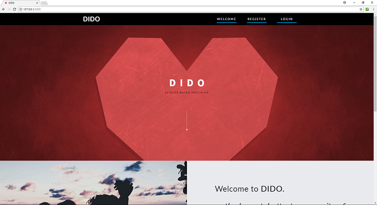

# Dido-Matchmaker

A dating web app used to connect two people together through their speech.

## Table of content

- [Getting started](#getting-started)
    - [Prerequisites](#prerequisites)
    - [Installing](#installing)
- [Built with](#built-with)
- [Deployment](#deployment)
- [Authors](#authors)
- [Acknowledgements](#acknowledgements)


## Getting Started

These instructions will get you a copy of the project up and running on your local machine for development and testing purposes. See deployment for notes on how to deploy the project on a live system.

### Prerequisites

You have to first install Python 2.7.x. Download from [here](https://www.python.org/downloads/) and follow the prompts to install.

### Installing

The package manager [pip](https://pip.pypa.io/en/stable/installing/) will be used to install virtualenv. It is already installed if you're using Python 2 >= 2.7.9.

In your terminal:

Install virtualenv

**Note**: errors may occur with package managers - if you're on Ubuntu try apt-get.

```
$ [sudo] pip install virtualenv
or
$ [sudo] apt-get install python virtual-env
```

Once virtualenv is installed, create your own environment. We'll create a folder ```venv``` within the project folder.

```
$ virtualenv venv
New python executable in venv/bin/python
Installing setuptools, pip............done.
```

To work on the project, activate the corresponding environment.

```
$ source venv/bin/activate
```

**Note:** to get out of the environment at any time, just type:
```
$ deactivate
```

You should now be using your virtualenv (your prompt on your shell should have changed to show the active environment).

Now install the dependencies.

```
$ pip install -r requirements.txt
```

Run the application.

```
$ python app.py
```

The application is now running locally at: [http://127.0.0.1:5000](http://127.0.0.1:5000)

Click the link above or enter that into the address of your browser - it will direct you to the landing page: 


## Deployment

Once you have implemented a feature localled and are ready to add it to the live sit. Simply do the following:

1. Push to a Github repository.
2. SSH into the EC2 server hosted on AWS (details on how to do that [here](http://docs.aws.amazon.com/AWSEC2/latest/UserGuide/AccessingInstancesLinux.html))
3. Shutdown Flask server.
4. Pull from the Github repository.
5. Re-run Flask server.

## Built With

* [Flask](http://flask.pocoo.org/docs/0.12/) - the Python microframework used
* [Jinja2](http://jinja.pocoo.org/docs/2.9/) - a modern and designer-friendly templating language for Python

## Authors

* **Ben Diep** - *Initial work* - [bendiep1991](https://github.com/bendiep1991)
* **Damon Toumbourou** - *Initial work* - [DamonToumbourou](https://github.com/DamonToumbourou)
* **Alex Cheong** - *Initial work* - [A-Cheong](https://github.com/A-Cheong)

## Acknowledgments


